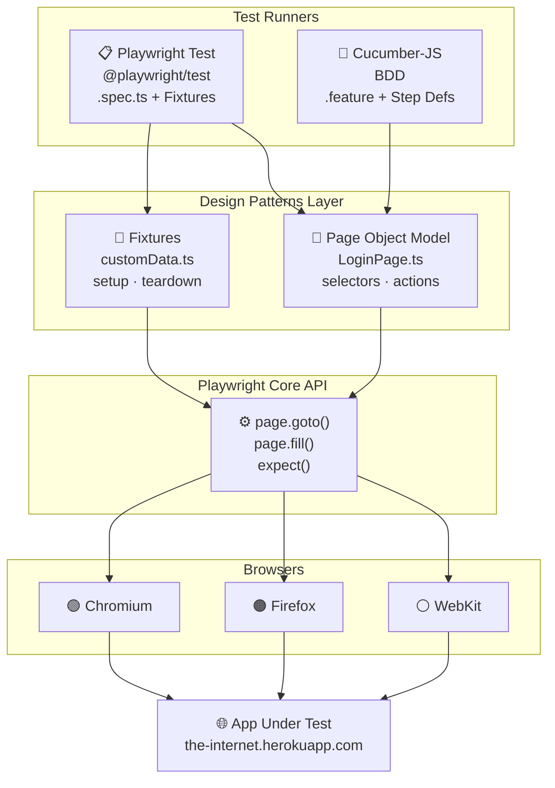

# Playwright Design Patterns

A hands-on reference project demonstrating how to apply software design patterns to end-to-end test automation using [Playwright](https://playwright.dev). Each chapter introduces a new pattern, building on the previous one.

---

## Table of Contents

- [What is Playwright?](#what-is-playwright)
- [Test Application](#test-application)
- [Project Structure](#project-structure)
- [Architecture Overview](#architecture-overview)
- [Design Patterns Covered](#design-patterns-covered)
- [Getting Started](#getting-started)
- [Running Tests](#running-tests)
- [Playwright Examples](#playwright-examples)
- [Debugging](#debugging)
- [Recommendations & Further Patterns](#recommendations--further-patterns)

---

## What is Playwright?

Playwright is a Node.js library by Microsoft for automating web browsers (Chromium, Firefox, WebKit) with a single API. Key capabilities:

- **Cross-browser** — one test runs on Chrome, Firefox, and Safari
- **Auto-wait** — waits for elements to be ready before acting, no manual sleeps needed
- **Network interception** — mock or intercept API calls at the browser level
- **Tracing & screenshots** — built-in visual debugging tools
- **Parallel execution** — tests run in parallel workers by default

---

## Test Application

This project tests against [**The Internet**](https://the-internet.herokuapp.com) — a free, publicly hosted Heroku app built specifically for practising UI automation. It provides ready-made pages for common scenarios: login, checkboxes, dropdowns, drag-and-drop, file upload, alerts, iframes, and more.

| Detail | Value |
|---|---|
| URL | https://the-internet.herokuapp.com |
| Login page | https://the-internet.herokuapp.com/login |
| Valid credentials | `tomsmith` / `SuperSecretPassword!` |
| Hosting | Heroku free tier (may have cold-start delays) |

> No account or setup required — just run the tests and they hit the live site.

---

## Project Structure

```
playwright-design-patterns/
│
├── tests/                          # Playwright Test specs (Chapters 1 & 2)
│   ├── no-fixtures.spec.ts         # Raw test without fixtures (anti-pattern demo)
│   ├── with-fixtures.spec.ts       # Built-in Playwright fixtures
│   ├── customFixtures-data.spec.ts # Custom fixture definition
│   ├── useCustomFixtures-data.spec.ts # Test consuming custom fixtures
│   ├── example.spec.ts             # Basic sanity test
│   │
│   ├── fixtures/
│   │   └── customData.ts           # Custom fixture: test data setup/teardown
│   │
│   └── pages/
│       └── LoginPage.ts            # Page Object Model for the Login page
│
├── features/                       # Cucumber BDD specs (Chapter 3)
│   ├── login.feature               # Gherkin scenarios
│   ├── step-definitions/           # Step implementations
│   └── support/
│       ├── world.ts                # Shared test context (browser, page)
│       └── hooks.ts                # Before/After hooks (browser lifecycle)
│
├── playwright.config.ts            # Playwright configuration
├── cucumber.json                   # Cucumber configuration
├── tsconfig.json                   # TypeScript configuration
└── package.json
```

---

## Architecture Overview



---

## Design Patterns Covered

### 1. Fixtures (Chapter 2)

**What:** Fixtures are reusable setup/teardown blocks injected into tests. Playwright has built-in fixtures (`page`, `browser`, `context`) and lets you define custom ones.

**Why:** Avoids duplicating setup code across tests. Keeps tests focused on behavior, not infrastructure.

```
tests/fixtures/customData.ts   ← defines the fixture
tests/useCustomFixtures-data.spec.ts ← consumes it
```

**TDD angle:** Write the fixture contract first (what data shape your test needs), then implement it — classic test-driven thinking applied to test infrastructure.

---

### 2. Page Object Model — POM (Chapter 2)

**What:** Each page or component of the app is represented as a TypeScript class. Selectors and actions live in the class, not scattered across tests.

**Why:** When the UI changes, you update one class instead of every test that touches that page.

```
tests/pages/LoginPage.ts
  └── goto()         → navigates to the login URL
  └── login()        → fills credentials and submits
  └── flashError     → locator for error message
  └── flashSuccess   → locator for success message
```

---

### 3. BDD — Behavior Driven Development (Chapter 3)

**What:** Tests are written in plain English using the **Gherkin** syntax (`Given / When / Then`) inside `.feature` files. Step definitions map those sentences to Playwright actions.

**Why:** Bridges the gap between business stakeholders, QA, and developers. The feature file is the single source of truth for expected behavior.

```
features/login.feature         ← human-readable scenarios
features/step-definitions/     ← TypeScript implementations
features/support/world.ts      ← shared context (page, browser)
features/support/hooks.ts      ← browser lifecycle (Before/After)
```

---

### 4. TDD — Test Driven Development

**What:** Write a failing test first, implement the minimum code to make it pass, then refactor.

**In this project:** The `no-fixtures.spec.ts` and `with-fixtures.spec.ts` files demonstrate the progression — starting from the raw approach (no pattern) toward the structured fixture + POM approach that emerges from iterating on tests first.

**Recommended flow:**
1. Write a failing Playwright test describing new behavior
2. Implement the page action or fixture
3. Run tests green, then refactor the POM/fixture

---

## Getting Started

### Prerequisites

- Node.js 18+
- npm

### Install

```bash
npm install
npx playwright install
```

---

## Running Tests

### Playwright tests (Fixtures + POM)

```bash
# Run all Playwright specs
npm run test:playwright

# Open interactive HTML report after the run
npx playwright show-report
```

### BDD tests (Cucumber + Gherkin)

```bash
# Headless (default — CI friendly)
npm run test:cucumber

# Headed — watch the browser in action
HEADLESS=false npm run test:cucumber

# Run a single feature file
npx cucumber-js features/login.feature
```

After each Cucumber run, open `cucumber-report.html` in your browser for a full visual report.

---

## Playwright Examples

These examples use the Heroku test app and show common Playwright patterns you can apply directly to this project.

### Navigate and assert page title

```ts
import { test, expect } from '@playwright/test';

test('login page has correct title', async ({ page }) => {
  await page.goto('https://the-internet.herokuapp.com/login');
  await expect(page).toHaveTitle('The Internet');
});
```

### Fill a form and assert success

```ts
test('successful login shows secure area', async ({ page }) => {
  await page.goto('https://the-internet.herokuapp.com/login');
  await page.getByRole('textbox', { name: 'Username' }).fill('tomsmith');
  await page.getByRole('textbox', { name: 'Password' }).fill('SuperSecretPassword!');
  await page.locator('i.fa-sign-in').click();

  await expect(page.locator('#flash.flash.success')).toBeVisible();
  await expect(page).toHaveURL(/secure/);
});
```

### Assert error on bad credentials

```ts
test('bad credentials shows error', async ({ page }) => {
  await page.goto('https://the-internet.herokuapp.com/login');
  await page.getByRole('textbox', { name: 'Username' }).fill('baduser');
  await page.getByRole('textbox', { name: 'Password' }).fill('wrongpass');
  await page.locator('i.fa-sign-in').click();

  await expect(page.locator('#flash.flash.error')).toBeVisible();
});
```

### Using the Page Object Model

```ts
import { test, expect } from '@playwright/test';
import { LoginPage } from './pages/LoginPage';

test('login with POM', async ({ page }) => {
  const loginPage = new LoginPage(page);
  await loginPage.goto();
  await loginPage.login('tomsmith', 'SuperSecretPassword!');

  await expect(loginPage.flashSuccess).toBeVisible();
});
```

### Using a custom fixture

```ts
import { test, expect } from './fixtures/customData';
import { LoginPage } from './pages/LoginPage';

test('login with fixture data', async ({ page, customData }) => {
  const loginPage = new LoginPage(page);
  await loginPage.goto();
  await loginPage.login(customData.goodData.username, customData.goodData.password);

  await expect(loginPage.flashSuccess).toBeVisible();
});
```

### Take a screenshot on demand

```ts
test('capture screenshot after login', async ({ page }) => {
  await page.goto('https://the-internet.herokuapp.com/login');
  await page.getByRole('textbox', { name: 'Username' }).fill('tomsmith');
  await page.getByRole('textbox', { name: 'Password' }).fill('SuperSecretPassword!');
  await page.locator('i.fa-sign-in').click();
  await page.screenshot({ path: 'screenshots/secure-area.png' });
});
```

### Intercept a network request (mocking)

```ts
test('mock login API response', async ({ page }) => {
  await page.route('**/authenticate', route =>
    route.fulfill({ status: 200, body: JSON.stringify({ token: 'fake-token' }) })
  );

  await page.goto('https://the-internet.herokuapp.com/login');
  // rest of test proceeds with mocked response
});
```

---

## Debugging

| Technique | Command / How |
|---|---|
| **Playwright Inspector** | `PWDEBUG=1 npm run test:playwright` — step through actions visually |
| **Headed mode (Playwright)** | Set `headless: false` in `playwright.config.ts` or use `--headed` flag |
| **Headed mode (Cucumber)** | `HEADLESS=false npm run test:cucumber` |
| **Trace Viewer** | Traces are captured on retry. View with `npx playwright show-trace trace.zip` |
| **Slow motion** | Add `slowMo: 500` to `chromium.launch()` in `hooks.ts` to slow each action |
| **Screenshots on failure** | Add `screenshot: 'only-on-failure'` to `use` block in `playwright.config.ts` |
| **VS Code Extension** | Install the [Playwright Test for VS Code](https://marketplace.visualstudio.com/items?itemName=ms-playwright.playwright) extension to run and debug tests from the editor |

---

## Recommendations & Further Patterns

### API Testing

Playwright can test REST APIs directly — no browser needed:

```ts
test('API login returns 200', async ({ request }) => {
  const res = await request.post('/api/login', {
    data: { username: 'tomsmith', password: 'SuperSecretPassword!' }
  });
  expect(res.status()).toBe(200);
});
```

Combine API + UI: use the API to create test data, then verify it in the browser — faster and more reliable than UI-only setup.

---

### Additional Patterns to Explore

| Pattern | Description |
|---|---|
| **Factory / Builder** | Create complex test data objects with a fluent builder instead of raw literals |
| **Screenplay** | Actor-centric pattern: actors have abilities (browse web), perform tasks (log in), ask questions (is visible?) |
| **API Mocking** | Use `page.route()` to intercept and stub network calls — test UI independently of back-end |
| **Visual Regression** | `expect(page).toHaveScreenshot()` — catch unintended UI changes automatically |
| **Component Testing** | Playwright supports mounting React/Vue/Svelte components in isolation |
| **Global Setup/Teardown** | Use `globalSetup` in `playwright.config.ts` to authenticate once and reuse session state across all tests |
| **Environment Config** | Drive `baseURL`, credentials, and browser choice from `.env` files using `dotenv` |

---

### Recommended Project Conventions

- Keep one POM class per page/component
- Keep fixtures focused on a single concern (data, auth, mock server)
- Never hard-code URLs — use `baseURL` from config
- Tag BDD scenarios (`@smoke`, `@regression`) to run subsets: `npx cucumber-js --tags @smoke`
- Store sensitive credentials in environment variables, never in source code
