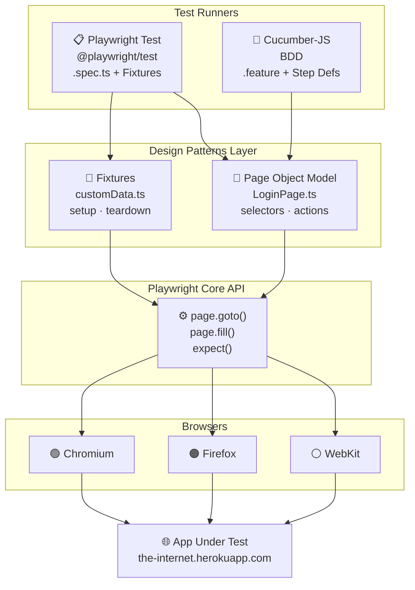

# Playwright Design Patterns

A hands-on reference project demonstrating how to apply software design patterns to end-to-end test automation using [Playwright](https://playwright.dev). Each chapter introduces a new pattern, building on the previous one.

---

## Table of Contents

- [What is Playwright?](#what-is-playwright)
- [Test Application](#test-application)
- [Project Structure](#project-structure)
- [Architecture Overview](#architecture-overview)
- [Design Patterns Covered](#design-patterns-covered)
- [Getting Started](#getting-started)
- [Running Tests](#running-tests)
- [Playwright Examples](#playwright-examples)
- [Debugging](#debugging)
- [Recommendations & Further Patterns](#recommendations--further-patterns)
- [Troubleshooting & CI/CD Agentic Chapters](#troubleshooting--cd-agentic-chapters)

---

## What is Playwright?

Playwright is a Node.js library by Microsoft for automating web browsers (Chromium, Firefox, WebKit) with a single API. Key capabilities:

- **Cross-browser** — one test runs on Chrome, Firefox, and Safari
- **Auto-wait** — waits for elements to be ready before acting, no manual sleeps needed
- **Network interception** — mock or intercept API calls at the browser level
- **Tracing & screenshots** — built-in visual debugging tools
- **Parallel execution** — tests run in parallel workers by default

---

## Test Application

This project tests against [**The Internet**](https://the-internet.herokuapp.com) — a free, publicly hosted Heroku app built specifically for practising UI automation. It provides ready-made pages for common scenarios: login, checkboxes, dropdowns, drag-and-drop, file upload, alerts, iframes, and more.

| Detail | Value |
|---|---|
| URL | https://the-internet.herokuapp.com |
| Public demo credentials | `tomsmith` / `SuperSecretPassword!` (public demo-only credentials for this practice site) |
| Hosting | Heroku free tier (may have cold-start delays) |

> No account or setup required — just run the tests and they hit the live site.
>
> Security note: these credentials are publicly available demo credentials for the external practice site and are included here only for convenience. They are not application secrets and should not be treated as an example for documenting production credentials.
> No account or setup required — just run the tests and they hit the live site.

---

## Project Structure

```
playwright-design-patterns/
│
├── tests/
│   ├── no-fixtures.spec.ts            # Raw test, no fixture (anti-pattern demo)
│   ├── with-fixtures.spec.ts          # Built-in Playwright fixtures
│   ├── customFixtures-data.spec.ts    # Custom fixture definition
│   ├── useCustomFixtures-data.spec.ts # Test consuming custom fixtures
│   ├── data-driven-login.spec.ts      # ★ Data-driven tests loaded from JSON
│   ├── api-login.spec.ts              # ★ API tests + API+UI hybrid pattern
│   ├── example.spec.ts                # Basic sanity test
│   │
│   ├── data/
│   │   └── login.data.json            # ★ Externalised test data (valid/invalid users)
│   │
│   ├── fixtures/
│   │   ├── customData.ts              # Inline fixture: hardcoded test data
│   │   └── loginDataFixture.ts        # ★ Fixture that loads from JSON data file
│   │
│   └── pages/
│       └── LoginPage.ts               # Page Object Model for the Login page
│
├── features/                          # Cucumber BDD specs (Chapter 3)
│   ├── login.feature                  # Gherkin scenarios
│   ├── step-definitions/              # Step implementations
│   └── support/
│       ├── world.ts                   # Shared test context (browser, page)
│       └── hooks.ts                   # Before/After hooks (browser lifecycle)
│
├── playwright.config.ts               # Playwright configuration
├── cucumber.json                      # Cucumber configuration
├── tsconfig.json                      # TypeScript configuration
└── package.json
```

---

## Architecture Overview



---

## Design Patterns Covered

### 1. Fixtures (Chapter 2)

**What:** Fixtures are reusable setup/teardown blocks injected into tests. Playwright has built-in fixtures (`page`, `browser`, `context`) and lets you define custom ones.

**Why:** Avoids duplicating setup code across tests. Keeps tests focused on behavior, not infrastructure.

```
tests/fixtures/customData.ts   ← defines the fixture
tests/useCustomFixtures-data.spec.ts ← consumes it
```

**TDD angle:** Write the fixture contract first (what data shape your test needs), then implement it — classic test-driven thinking applied to test infrastructure.

---

### 2. Page Object Model — POM (Chapter 2)

**What:** Each page or component of the app is represented as a TypeScript class. Selectors and actions live in the class, not scattered across tests.

**Why:** When the UI changes, you update one class instead of every test that touches that page.

```
tests/pages/LoginPage.ts
  └── goto()         → navigates to the login URL
  └── login()        → fills credentials and submits
  └── flashError     → locator for error message
  └── flashSuccess   → locator for success message
```

---

### 3. BDD — Behavior Driven Development (Chapter 3)

**What:** Tests are written in plain English using the **Gherkin** syntax (`Given / When / Then`) inside `.feature` files. Step definitions map those sentences to Playwright actions.

**Why:** Bridges the gap between business stakeholders, QA, and developers. The feature file is the single source of truth for expected behavior.

```
features/login.feature         ← human-readable scenarios
features/step-definitions/     ← TypeScript implementations
features/support/world.ts      ← shared context (page, browser)
features/support/hooks.ts      ← browser lifecycle (Before/After)
```

---

### 4. TDD — Test Driven Development

**What:** Write a failing test first, implement the minimum code to make it pass, then refactor.

**In this project:** The `no-fixtures.spec.ts` and `with-fixtures.spec.ts` files demonstrate the progression — starting from the raw approach (no pattern) toward the structured fixture + POM approach that emerges from iterating on tests first.

**Recommended flow:**
1. Write a failing Playwright test describing new behavior
2. Implement the page action or fixture
3. Run tests green, then refactor the POM/fixture

---

## Getting Started

### Prerequisites

- Node.js 18+
- npm

### Install

```bash
npm install
npx playwright install
```

---

## Running Tests

Each concept in this project can be run independently. Use the commands below to explore each pattern on its own.

---

### Run everything

```bash
# All Playwright specs (all chapters)
npm run test:playwright

# All BDD / Cucumber specs
npm run test:cucumber
```

---

### Chapter 1 — No Fixtures (anti-pattern demo)

> Shows what tests look like *without* any pattern. Useful as a baseline to understand why fixtures and POM matter.

```bash
npx playwright test no-fixtures --reporter=list,html && npx playwright show-report
```

---

### Chapter 2a — Built-in Playwright Fixtures

> Demonstrates Playwright's built-in `page` fixture vs manually launching a browser. Compare `no-fixtures.spec.ts` with `with-fixtures.spec.ts`.

```bash
npx playwright test with-fixtures --reporter=list,html && npx playwright show-report
```

---

### Chapter 2b — Custom Fixtures

> Shows how to define and consume a custom fixture that injects typed test data into tests.

```bash
npx playwright test useCustomFixtures-data --reporter=list,html && npx playwright show-report
```

---

### Chapter 2c — Page Object Model (POM)

> The POM is used across multiple specs. Run the custom fixtures test to see POM (`LoginPage.ts`) in action alongside fixtures.

```bash
npx playwright test useCustomFixtures-data --reporter=list,html && npx playwright show-report
```

---

### Chapter 2d — Data-Driven Tests

> Test cases are loaded from `tests/data/login.data.json`. Each JSON entry becomes a named test. Add new scenarios by editing the JSON — no code changes needed.

```bash
npx playwright test data-driven-login --reporter=list,html && npx playwright show-report
```

---

### Chapter 2e — API Tests

> Uses Playwright's built-in `request` fixture — no browser launched. Covers status codes, form POSTs, response headers, and an API+UI hybrid pattern.

```bash
npx playwright test api-login --reporter=list,html && npx playwright show-report
```

---

### Chapter 3 — BDD with Cucumber (Gherkin)

> Scenarios written in plain English (`Given / When / Then`) in `.feature` files. Step definitions wire them to Playwright actions.

```bash
# Headless (default — CI friendly)
npm run test:cucumber

# Headed — watch the browser in action
HEADLESS=false npm run test:cucumber

# Run a single feature file
npx cucumber-js features/login.feature
```

After each Cucumber run, open `cucumber-report.html` in your browser for a full visual report.

---

## Playwright Examples

These examples use the Heroku test app and show common Playwright patterns you can apply directly to this project.

### Navigate and assert page title

```ts
import { test, expect } from '@playwright/test';

test('login page has correct title', async ({ page }) => {
  await page.goto('https://the-internet.herokuapp.com/login');
  await expect(page).toHaveTitle('The Internet');
});
```

### Fill a form and assert success

```ts
test('successful login shows secure area', async ({ page }) => {
  await page.goto('https://the-internet.herokuapp.com/login');
  await page.getByRole('textbox', { name: 'Username' }).fill('tomsmith');
  await page.getByRole('textbox', { name: 'Password' }).fill('SuperSecretPassword!');
  await page.locator('i.fa-sign-in').click();

  await expect(page.locator('#flash.flash.success')).toBeVisible();
  await expect(page).toHaveURL(/secure/);
});
```

### Assert error on bad credentials

```ts
test('bad credentials shows error', async ({ page }) => {
  await page.goto('https://the-internet.herokuapp.com/login');
  await page.getByRole('textbox', { name: 'Username' }).fill('baduser');
  await page.getByRole('textbox', { name: 'Password' }).fill('wrongpass');
  await page.locator('i.fa-sign-in').click();

  await expect(page.locator('#flash.flash.error')).toBeVisible();
});
```

### Using the Page Object Model

```ts
import { test, expect } from '@playwright/test';
import { LoginPage } from './pages/LoginPage';

test('login with POM', async ({ page }) => {
  const loginPage = new LoginPage(page);
  await loginPage.goto();
  await loginPage.login('tomsmith', 'SuperSecretPassword!');

  await expect(loginPage.flashSuccess).toBeVisible();
});
```

### Using a custom fixture

```ts
import { test, expect } from './fixtures/customData';
import { LoginPage } from './pages/LoginPage';

test('login with fixture data', async ({ page, customData }) => {
  const loginPage = new LoginPage(page);
  await loginPage.goto();
  await loginPage.login(customData.goodData.username, customData.goodData.password);

  await expect(loginPage.flashSuccess).toBeVisible();
});
```

### Take a screenshot on demand

```ts
test('capture screenshot after login', async ({ page }) => {
  await page.goto('https://the-internet.herokuapp.com/login');
  await page.getByRole('textbox', { name: 'Username' }).fill('tomsmith');
  await page.getByRole('textbox', { name: 'Password' }).fill('SuperSecretPassword!');
  await page.locator('i.fa-sign-in').click();
  await page.screenshot({ path: 'screenshots/secure-area.png' });
});
```

### Intercept a network request (mocking)

```ts
test('mock login API response', async ({ page }) => {
  await page.route('**/authenticate', route =>
    route.fulfill({ status: 200, body: JSON.stringify({ token: 'fake-token' }) })
  );

  await page.goto('https://the-internet.herokuapp.com/login');
  // rest of test proceeds with mocked response
});
```

---

## Debugging

| Technique | Command / How |
|---|---|
| **Playwright Inspector** | `PWDEBUG=1 npm run test:playwright` — step through actions visually |
| **Headed mode (Playwright)** | Set `headless: false` in `playwright.config.ts` or use `--headed` flag |
| **Headed mode (Cucumber)** | `HEADLESS=false npm run test:cucumber` |
| **Trace Viewer** | Traces are captured on retry. View with `npx playwright show-trace trace.zip` |
| **Slow motion** | Add `slowMo: 500` to `chromium.launch()` in `hooks.ts` to slow each action |
| **Screenshots on failure** | Add `screenshot: 'only-on-failure'` to `use` block in `playwright.config.ts` |
| **VS Code Extension** | Install the [Playwright Test for VS Code](https://marketplace.visualstudio.com/items?itemName=ms-playwright.playwright) extension to run and debug tests from the editor |

---

## Recommendations & Further Patterns

### Data-Driven Testing

Test data lives in `tests/data/login.data.json`. Each entry is a self-describing object with a `description` field that becomes the test name automatically:

```json
{
  "invalidUsers": [
    { "description": "wrong password",    "username": "tomsmith", "password": "wrongpassword", "expectedMessage": "Your password is invalid!" },
    { "description": "unknown username",  "username": "baduser",  "password": "password123",   "expectedMessage": "Your username is invalid!" },
    { "description": "empty credentials", "username": "",         "password": "",              "expectedMessage": "Your username is invalid!" }
  ]
}
```

The spec loops over the array — **no code changes needed to add new scenarios**, only data:

```ts
// tests/data-driven-login.spec.ts
for (const user of loginData.invalidUsers) {
    test(`[invalid] ${user.description}`, async ({ page }) => {
        const loginPage = new LoginPage(page);
        await loginPage.goto();
        await loginPage.login(user.username, user.password);
        await expect(loginPage.flashError).toContainText(user.expectedMessage);
    });
}
```

The same data is also available as a **fixture** (`tests/fixtures/loginDataFixture.ts`) if you prefer dependency injection over direct imports.

---

### API Testing

Playwright's built-in `request` fixture makes HTTP calls without a browser. See `tests/api-login.spec.ts` for the full suite. Key patterns:

**Status code check:**
```ts
test('login page returns 200', async ({ request }) => {
    const response = await request.get('https://the-internet.herokuapp.com/login');
    expect(response.status()).toBe(200);
});
```

**Form POST and body assertion:**
```ts
test('valid credentials POST returns success', async ({ request }) => {
    const response = await request.post('https://the-internet.herokuapp.com/authenticate', {
        form: { username: 'tomsmith', password: 'SuperSecretPassword!' }
    });
    const body = await response.text();
    expect(body).toContain('You logged into a secure area!');
});
```

**API + UI hybrid** — health-check the endpoint via API, then run the UI flow:
```ts
test('API health check then UI login', async ({ page, request }) => {
    const apiCheck = await request.get('https://the-internet.herokuapp.com/login');
    expect(apiCheck.status()).toBe(200);          // fast API gate

    await page.goto('https://the-internet.herokuapp.com/login');
    // ... full UI login flow
});
```

---

### Additional Patterns to Explore

| Pattern | Description |
|---|---|
| **Factory / Builder** | Create complex test data objects with a fluent builder instead of raw literals |
| **Screenplay** | Actor-centric pattern: actors have abilities (browse web), perform tasks (log in), ask questions (is visible?) |
| **API Mocking** | Use `page.route()` to intercept and stub network calls — test UI independently of back-end |
| **Visual Regression** | `expect(page).toHaveScreenshot()` — catch unintended UI changes automatically |
| **Component Testing** | Playwright supports mounting React/Vue/Svelte components in isolation |
| **Global Setup/Teardown** | Use `globalSetup` in `playwright.config.ts` to authenticate once and reuse session state across all tests |
| **Environment Config** | Drive `baseURL`, credentials, and browser choice from `.env` files using `dotenv` |

---

### Recommended Project Conventions

- Keep one POM class per page/component
- Keep fixtures focused on a single concern (data, auth, mock server)
- Never hard-code URLs — use `baseURL` from config
- Tag BDD scenarios (`@smoke`, `@regression`) to run subsets: `npx cucumber-js --tags @smoke`
- Store sensitive credentials in environment variables, never in source code

---

## Troubleshooting & CI/CD Agentic Chapters

### Common Issues & How to Fix

| Symptom | Possible Cause | How to Fix |
|---|---|---|
| Lint errors (e.g. `no-empty-pattern`, `not defined`) | ESLint/TypeScript config mismatch, Playwright fixture destructuring | See `.eslintrc.json` for rules. For Playwright fixtures, use `async ({}, use)` and add `// eslint-disable-next-line no-empty-pattern` above the line. Run `npx eslint . --ext .ts --format unix` locally before pushing. |
| `process is not defined` in config | Missing import | Add `import process from 'process';` to `playwright.config.ts`. |
| `defineConfig` or `devices` not defined | Missing import | Add `import { defineConfig, devices } from '@playwright/test';` to `playwright.config.ts`. |
| Tests fail on CI but pass locally | Environment differences, missing dependencies | Ensure Node.js version matches (`node -v`). Run `npm ci` and `npx playwright install` locally. |
| Browser not launching | Playwright browsers not installed | Run `npx playwright install --with-deps`. |
| Cucumber step errors | Step definition signature mismatch | Ensure step definitions match Gherkin steps. Remove unused `this` or use `// @ts-ignore` if required by Cucumber. |
| API tests fail | Heroku app cold start or downtime | Retry after a few minutes. |

### Agentic Chapters & Live Agenda

This project is designed for agentic, step-by-step learning and real-world CI/CD scenarios. Each chapter builds on the previous, and you can go agentic (let an agent or automation guide/fix/extend) at any point:

- **Chapter 1:** Baseline tests, no patterns (manual, anti-pattern)
- **Chapter 2:** Fixtures, POM, data-driven, API, custom patterns
- **Chapter 3:** BDD with Cucumber, step definitions, hooks
- **Chapter 4:** CI/CD with GitHub Actions, linting, security scan, Playwright in CI
- **Chapter 5+:** Agentic workflows — let an agent (e.g. GitHub Copilot, custom bot) fix lint errors, update config, or refactor code. Use PRs, issues, and CI feedback to drive improvements. Keep the agenda live: always address CI failures, lint errors, and code review feedback as they arise.

#### How to Go Agentic

1. **Check CI/CD status:** Review GitHub Actions for failed jobs (test, lint, security).
2. **Run jobs locally:** Use the same commands as in `.github/workflows/ci.yml` (e.g. `npx eslint . --ext .ts --format unix`, `npx playwright test`).
3. **Let the agent fix issues:** Use Copilot or your automation to apply fixes, explain changes, and commit.
4. **Document troubleshooting:** Update this README with new issues and solutions as you encounter them.

---

## CI/CD Pipeline (Chapter 5+)

This project uses GitHub Actions for continuous integration. On every push or pull request, the following jobs run:

- **Test:** Runs all Playwright tests headlessly and uploads the HTML report as an artifact.
- **Lint:** Runs ESLint on all TypeScript files using the command:
  ```bash
  npx eslint . --ext .ts --format unix
  ```
  Run this locally before pushing to avoid CI failures.
- **Security:** Runs `npm audit --audit-level=moderate --json > audit.json || true` and uploads the audit report as an artifact.

See `.github/workflows/ci.yml` for details.

---

## NPM Scripts

- `npm run test:playwright` — Run all Playwright specs (recommended for CI and local dev)
- `npm run test:cucumber` — Run all BDD/Cucumber specs

---

## Linting & Fixture Patterns

- Playwright custom fixtures must use the object destructuring pattern for the first argument:
  ```ts
  // eslint-disable-next-line no-empty-pattern
  customData: async ({}, use) => { ... }
  ```
  This disables the ESLint `no-empty-pattern` rule only for this line, which is required by Playwright's API.
- Always run `npx eslint . --ext .ts --format unix` locally before pushing to catch issues early.

---

## Security Scan

- The security job in CI runs `npm audit` and uploads the results. Review the `audit.json` artifact for vulnerabilities.

---

## Agentic/Live Agenda (Chapter 5+)

From Chapter 5 onward, this project adopts an agentic workflow:
- Use automation (Copilot, bots, or scripts) to fix, lint, and refactor code based on CI feedback.
- Keep this README and the troubleshooting section live and up to date as you encounter and solve new issues.
- Use PRs, issues, and CI feedback to drive improvements and document solutions.

---

## Project Structure Clarification

- Both `customFixtures-data.spec.ts` and `useCustomFixtures-data.spec.ts` are present and demonstrate custom fixture usage.
- All test, fixture, and config files referenced in this README exist in the repo and are actively used in the CI pipeline.

---

## Chapter 6: Advanced Patterns & Agentic Automation

This chapter explores advanced test automation patterns and deeper agentic workflows. We will:

- Introduce new design patterns (e.g., Factory/Builder for test data, Screenplay, API mocking, visual regression)
- Expand the CI/CD pipeline with new jobs or checks as needed
- Use agentic automation (Copilot, bots, scripts) to refactor, optimize, and document as we go
- Keep this README live: every new pattern, troubleshooting step, or CI/CD enhancement is documented here in real time

### Planned Topics
- Factory/Builder pattern for complex test data
- Screenplay pattern for actor-centric test design
- API mocking and network interception
- Visual regression testing with Playwright
- Component testing (if applicable)
- Global setup/teardown for session reuse
- Environment-driven config and secrets management

> As we implement each topic, the README will be updated with code examples, troubleshooting, and CI/CD integration notes.
